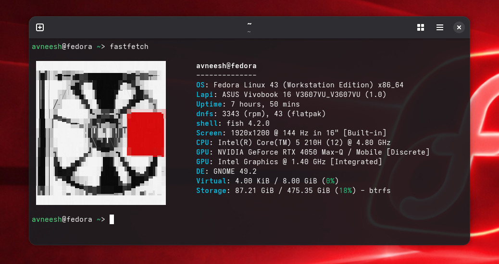

# DOTFILES

Dotfiles for my linux system 
 - [fish](https://github.com/abneeeees/dotfiles/tree/main/fish)
 - [fastfetch](https://github.com/abneeeees/dotfiles/tree/main/fastfetch)

## Usage

```bash
git clone https://github.com/abneeeees/dotfiles.git  (pretty obvious ig)
```

- #### change the path `~/Pictures/Camera/yeezus.jpg` and size of the image to your desired 
```bash
chafa --size=30x30 ~/Pictures/Camera/yeezus.jpg > /home/avneesh/ascii.txt
```
- #### follow these commands 

```bash
mkdir -p ~/.config/fastfetch
cp fastfetch/config.jsonc ~/.config/fastfetch/config.jsonc

mkdir -p ~/.config/fish
cp fish/config.fish ~/.config/fish/config.fish
```
## fastfetch


## Structure

```text
dotfiles/
├── fastfetch/
│   └── config.json
├── fish/
│   └── config.fish
│   └── yeezus.jpg
└── README.md

